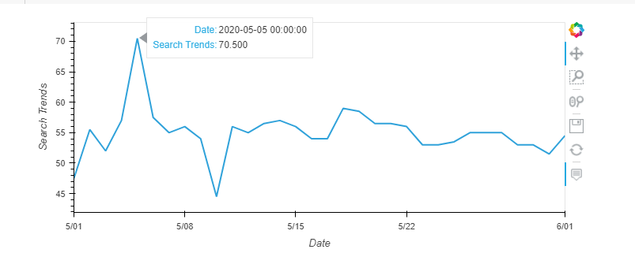

With over 200 million users, MercadoLibre is the most popular e-commerce site in Latin America. We have couple of data sets available for us,

- Google web search traffic data
- MercadoLibre stocks data
- MercadoLibre sales revenue data

We will use these data sets to attempt to answer some of the questions for our stakeholders -

- [ ] Find Unusual Patterns in Hourly Google Search Traffic
- [ ] Mine the Search Traffic Data for Seasonality
- [ ] Relate the Search Traffic to Stock Price Patterns
- [ ] Forecasts patterns in the hourly search data
- [ ] Forecast the Revenue by Using Time Series Models

We shall be using Pandas library of Python to do exploratory data analysis and Hvplot for basic visualizations. Finally we will use Facebook open source Prophet library to do forecasting on Time series data.

- [x] ==**Find Unusual Patterns in Hourly Google Search Traffic**==

Company had released their financial results on May 5th - [https://www.globenewswire.com/news-release/2020/05/05/2027880/0/en/MercadoLibre-Inc-Reports-First-Quarter-2020-Financial-Results.html.](https://www.globenewswire.com/news-release/2020/05/05/2027880/0/en/MercadoLibre-Inc-Reports-First-Quarter-2020-Financial-Results.htmlWe)

We did analysis for the month of May 2020 and our data shows a close relationship between the announcement and the amount of search traffic.

*Visualize the trend for May 2020*

> *This clearly shows a significant changes during some of the days, a sharp increase on 5th of May.*

- [x] ==**Mine the Search Traffic Data for Seasonality**==

**Which day of the week do we see more search, is there a seasonality?**

> *Above graph indicates that Tuesday or Wednesday seems to have higher activity. There is a seasonality here with search decreasing on later days.*

**Which hour of the day do we see more searches?**

> *From above it seems like the first two hours and last hour of the day the search trend is more. It will be interesting to see the location of those searches.*

**Does the search traffic tend to increase during the winter holiday period (weeks 40 through 52)?**

We will aggregate the trend data over week over all years

> *Above graph shows that the decline starts around week 35 and starts picking back again in week 44 and then again decline towards the last two weeks.*

- [x] ==**Relate the Search Traffic to Stock Price Patterns**==

Stakeholders  want to know if any relationship between the search data and the company stock price exists.

We will combine the stocks and the search traffic data on date column and remove fill null values with "0". We will then use plotly express to plot the combined data set.

if we focus on the areas where it shows -

- > *sharp drop on 25th Feb*
    
- > *and a spike increase on 5th of May*
    

In addition we create a number of new data columns -

- “Lagged Search Trends” that offsets, or shifts, the search traffic by one hour. Create two additional columns:
    
- “Stock Volatility”, which holds an exponentially weighted four-hour rolling average of the company’s stock volatility
    
- “Hourly Stock Return”, which holds the percent change of the company's stock price on an hourly basis
    

We will use Pandas inbuilt correlation function to find the relationship between search traffic and stock trends.

**Does a predictable relationship exist between the lagged search traffic and the stock volatility or between the lagged search traffic and the stock price returns?**

> *There does not seem to be strong correlation for either of those two categories.*

- [x] ==**Forecasts patterns in the hourly search data**==

We will be using facebook's Prophet library to do generate forecast.

Trends Forecast -

- Call the Prophet function, store as an object

          By default Prophet uses 80% confidence interval, we will change it to 95% using interval_width=0.95

              *Prophet(interval_width=0.95)*

- Create a future dataframe to hold predictions. Prophet provides an option to create a dataframe for out of sample data. Make the prediction go out as far as 2000 hours (approx 80 days)

             *make\_future\_dataframe(periods=2000, freq="H")*

- Predict and use plot_components to check the seasonality

> *Question: What time of day exhibits the greatest popularity?*
> 
> *Answer: # 12:00 AM*
> 
> *Question: Which day of week gets the most search traffic?*
> 
> *Answer: # Tuesday*
> 
> *Question: What's the lowest point for search traffic in the calendar year?*
> 
> *Answer: # October*
> 
> *We will use hvplot to visualize the forecasted trend, yhat (probable level), yhat\_lower(worst case) and yhat\_upper(best case).*

- [x] **==Forecast the Revenue by Using Time Series Models==**

In this scenario we will be using Prophet to answer following questions -

**Produce a sales forecast for the finance division**

# giving them a number for expected total sales next quarter.

# Provide best case (yhat\_upper), worst case (yhat\_lower), and most likely (yhat) scenarios.

> *Best Case 1096.207723*
> 
> *Worst Case 846.010844*
> 
> *Most Likely Case 969.577023*

We can also check visually -

**Conclusion** -

Prophet does provide a good option to generate forecast on Time Series data. The above analysis will provide our stakeholders a view into future to make some decisions.

We should plan for removal of seasonality, or any noise and do some more feature engineering to enhance our models.